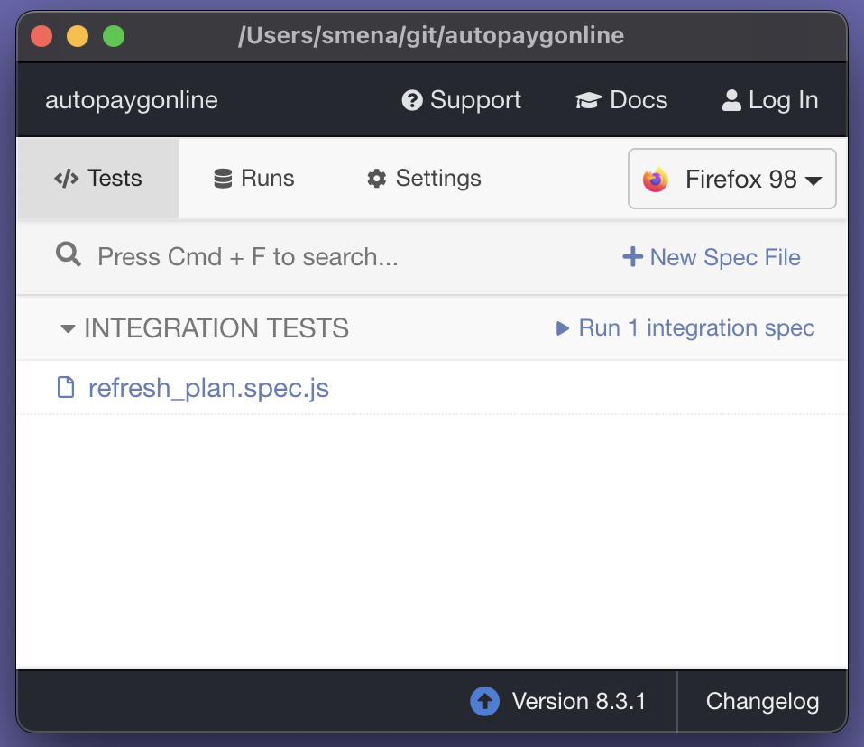
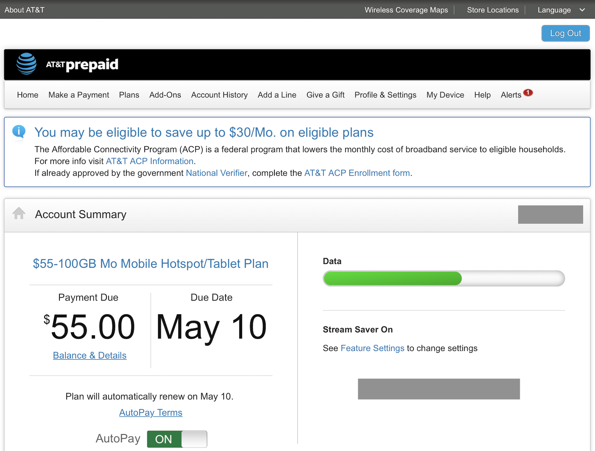

# autopaygonline

A script in the form of a Cypress test that automates refilling data on AT&T pre-paid hotspot accounts.

Normally these accounts will simply stop working once the data allocation is depleted, and refill again only at the beginning of the next billing cycle, even if you have auto-pay enabled.

# How it works

It takes advantage of a workaround in the billing portal allowing you to re-start a new billing cycle before the current one has ended by switching to another plan and switching back again without paying in between. You will, of course, be charged again for re-starting the cycle, but this just lets you do it sooner.

It can be done manually, but if you are a heavy data user, it is tedious and error-prone to do this repeatedly.

# Caveats, assumptions, and warnings

* This script assumes you want the plan with the lowest cost per gigabyte available when it was written: $55/100 GB.
* While it has some reasonable checks to ensure the newly selected plan is correct before charging, they could fail and leave you with an undesired plan.
* Running this when you are not out of data will forfeit the remaining data, since the billing cycle is restarting.
* There is no API or official method of doing this, so it is a workaround, first and foremost.
* AT&T might suddenly tell you that paying them more money more quickly is a ToS violation, and terminate your account. Why not.
* AT&T might change the layout, elements, or plans on the page, causing this script to stop working or behave unexpectedly.
* When this script was written, the portal looked like this: 

# Setup

1. Set environment variables with your credentials: `$CY_USERNAME` and `$CY_PASSWORD`
1. [Install yarn](https://classic.yarnpkg.com/lang/en/docs/install/)
1. `yarn init`
1. `yarn add cypress`

# Run

| ⚠️        | WARNING: This will incur charges!|
|---------------|:------------------------|

Be absolutely sure you understand what the code is doing before proceeding. Running this will immediately reset your plan, forfeit remaining data (if any), and charge the card you have on file.

If you are unsure about it, you can [perform the process manually.](#manual-process)

1. In the root of the repository: `yarn run cypress open --env CY_USERNAME=$CY_USERNAME,CY_PASSWORD=$CY_PASSWORD` 
1. Run the spec

# Manual process

1. Log in to [paygonline.com](paygonline.com)
1. Click "Plans"
1. Select "Change to this plan" on any plan on the page
1. Confirm the rate change, but do NOT pay: go back to the plans page
1. Select your original plan and confirm the rate change
1. Click continue in the payment box. Data will be refilled and a new billing cycle has started.
